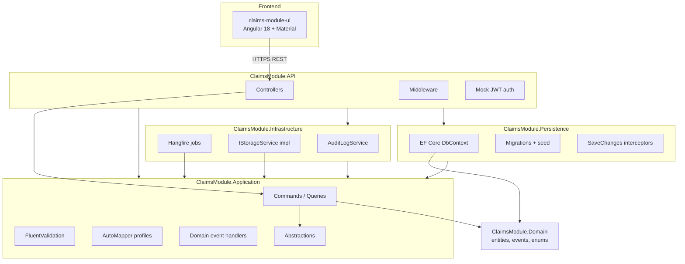
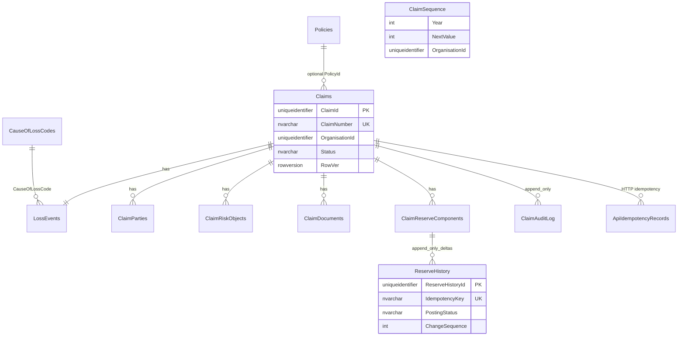
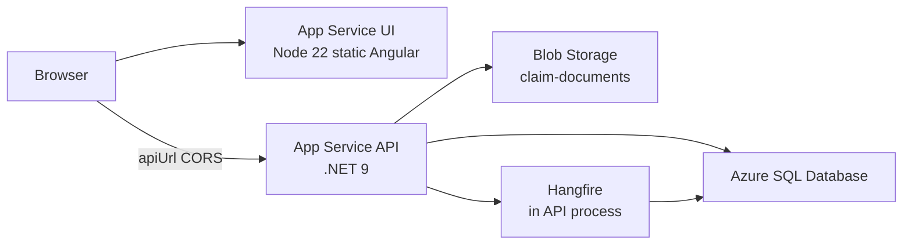

# Claims Module — Architecture

Architecture documentation for the DICEUS Fullstack Assessment

---

## 1. Solution structure

### 1.1 Projects and dependencies

Clean Architecture: **Domain** has zero external dependencies; outer layers depend inward.



| Project | Responsibility |
|---------|----------------|
| `ClaimsModule.Domain` | Entities, value objects, domain events, enums — **no** NuGet references to other layers |
| `ClaimsModule.Application` | MediatR CQRS, FluentValidation, DTOs, `IClaimsDbContext` / repository abstractions, AutoMapper, domain event handlers |
| `ClaimsModule.Persistence` | `ClaimsDbContext`, EF configurations, migrations, `UnitOfWork`, `DispatchDomainEventsInterceptor`, append-only interceptors |
| `ClaimsModule.Infrastructure` | Hangfire (`PostGLReserveChangeJob`, `SlaMonitoringJob`), Azure Blob / local file storage, `AuditLogService` |
| `ClaimsModule.API` | Composition root, controllers, Swagger, middleware, mock JWT (`ICurrentUserService`, `ICorrelationIdAccessor`, `ISystemClock`) |
| `claims-module-ui` | Angular 18 SPA — lazy feature modules, typed HTTP services, reactive forms |
| `tests/*` | Application unit tests; API integration smoke tests |

### 1.2 Repository layout

```
src/
  ClaimsModule.Domain/
  ClaimsModule.Application/
  ClaimsModule.Persistence/
  ClaimsModule.Infrastructure/
  ClaimsModule.API/
claims-module-ui/
tests/
  ClaimsModule.Application.Tests/
  ClaimsModule.API.Tests/
```

---

## 2. Data model

### 2.1 Aggregate roots and relationships

| Aggregate / entity | Role |
|--------------------|------|
| **Claim** | Root for FNOL: status workflow, parties, risk objects, documents, audit, linked policy (optional) |
| **LossEvent** | 1:1 with claim at creation — loss date, description, location, cause of loss |
| **ClaimReserveComponent** | One row per component type (Indemnity, Expense, ALAE, SubrogationRecoverable); `CurrentAmount` maintained from approved history |
| **ReserveHistory** | Append-only financial deltas + workflow/posting fields on pending rows |
| **ClaimAuditLog** | Append-only cross-cutting event log (BR-A-01) |
| **Policy** | Simulated PAS data (seeded); optional FK on claim |
| **CauseOfLossCodes** | Organisation-scoped reference data |
| **ClaimSequence** | Atomic claim number generation per year/tenant |
| **ApiIdempotencyRecords** | HTTP write deduplication (`Idempotency-Key` header) |



### 2.2 Conventions (FRS)

- PKs: `UNIQUEIDENTIFIER` with `NEWSEQUENTIALID()` where configured
- Money: `DECIMAL(19,4)`
- Timestamps: `DATETIMEOFFSET(7)` UTC
- Tenant: **`OrganisationId`** on all business tables (not Assessment `OrganizationEntityId`)
- Soft delete: `IsDeleted` + global query filters on master data
- Concurrency: `RowVer` on `Claims` and `ClaimReserveComponents`

### 2.3 Reserve model (hybrid — not pure event sourcing)

- **Financial deltas:** `Add` / `Adjust` / `Reverse` always **INSERT** new `ReserveHistory` rows; amounts and balances on a row are never rewritten
- **Workflow fields:** `ApprovalStatus`, approver/rejector metadata, `PostingStatus`, `PostingJobId` may be updated in place on the pending transaction (approve / reject / retract / GL job — FRS API §10.2)
- **`CurrentAmount`** on `ClaimReserveComponent` = running sum of approved/auto-approved deltas (authoritative; not a live `SUM(ReserveHistory)` query)
- **`ClaimAuditLog`:** `AppendOnlySaveChangesInterceptor` + SQL trigger `TR_ClaimAuditLog_AppendOnly_BR_A_01` (migration `0005`); `ReserveHistory` is not trigger-protected

---

## 3. CQRS flow

Every state change is a **Command** (`ICommand` / `ICommand<TResponse>`); every read is a **Query**. Controllers stay thin: map HTTP → MediatR request → `IMediator.Send()`.

### 3.1 Request path (example: approve reserve)

```
Client (Angular)
  → POST /api/claims/{id}/reserves/{txnId}/approve
  → ReservesController
  → mediator.Send(ApproveReserveCommand)
```

**MediatR pipeline** (order registered in `ClaimsModule.Application`):

1. **`ValidationBehaviour`** — runs all `IValidator<T>` for the request; **errors** → `ValidationException` → HTTP **422**; **warnings** collected for handlers that support soft rules
2. **`UnitOfWorkBehaviour`** — opens EF transaction for `ICommand` / `ICommand<T>` only
3. **`ApproveReserveCommandHandler`** — authority checks, updates `ReserveHistory`, raises `ReserveApprovedEvent` on aggregate
4. **`IUnitOfWork.SaveChangesAsync`** / `CommitAsync`
5. **`DispatchDomainEventsInterceptor`** (after `SaveChanges` completes) — collects events from `AggregateRoot` entities, clears queues, calls `IDomainEventDispatcher`
6. **`MediatRDomainEventDispatcher`** — publishes `DomainEventNotification<T>` to MediatR
7. **`ReserveApprovedEventHandler`** — `IJobScheduler.EnqueuePostGLReserveChange(...)`
8. Transaction commit (if no failure)

Queries skip `UnitOfWorkBehaviour` and typically use **`IClaimRepository`** / **`IReserveRepository`** or **`IClaimsDbContext`** without wrapping a command transaction.

### 3.2 Data access pattern

| Mechanism | Use |
|-----------|-----|
| **`IClaimsDbContext`** | Direct EF access from handlers; global filters (soft delete, tenant) |
| **`IClaimRepository` / `IReserveRepository`** | Focused reads/writes, SLA scan, GL job lookups, complex reserve queries |
| **`IUnitOfWork`** | Transaction boundary via `UnitOfWorkBehaviour` + explicit commit in handlers |
| **Generic `IRepository<T>`** | **Not used** — avoids redundant abstraction over EF |

### 3.3 API cross-cutting (before MediatR)

| Middleware | Purpose |
|------------|---------|
| `CorrelationIdMiddleware` | `X-Correlation-Id` or generated GUID → `ICorrelationIdAccessor` → all `IAuditLogService` writes (BR-A-03) |
| `IdempotencyKeyMiddleware` | Persists `Idempotency-Key` for supported write routes |
| `ExceptionHandlingMiddleware` | Maps `ValidationException` to RFC 422 body; other errors to problem details |
| `LocalStorageAccessMiddleware` | Serves signed local file URLs when `StorageProvider=LocalFileSystem` |

FluentValidation is registered on the **MediatR pipeline**, not only in controllers (Assessment §6.1).

### 3.4 Create claim (end-to-end summary)

`POST /api/claims` → `CreateClaimCommand` → validator (BR-C-01, BR-C-05, BR-C-07, parties, policy warnings) → handler creates `Claim`, `LossEvent`, parties, risk objects, optional reserve in **one transaction** → `ClaimCreatedEvent` → audit `CLAIM_CREATED` (+ `VALIDATION_ISSUE_ADDED` for warnings) → **201** with `ClaimNumber` from `ClaimSequence`.

---

## 4. Domain events

### 4.1 Lifecycle

1. Handler mutates an **`AggregateRoot`** and calls `RaiseDomainEvent(...)`.
2. EF **`SaveChangesAsync`** persists entities.
3. **`DispatchDomainEventsInterceptor`** runs on `SavedChanges` / `SavedChangesAsync`.
4. Events are dispatched via **`MediatRDomainEventDispatcher`** → `IPublisher.Publish(DomainEventNotification<T>)`.
5. **`INotificationHandler<DomainEventNotification<T>>`** in Application runs side effects (audit, Hangfire enqueue).

Side effects run **after** the database write succeeds for that unit of work.

### 4.2 Events and handlers

| Domain event | Raised when | Handler outcome |
|--------------|-------------|-----------------|
| `ClaimCreatedEvent` | FNOL create succeeds | `ClaimCreatedEventHandler` → `CLAIM_CREATED` audit |
| `ClaimStatusChangedEvent` | Status transition committed | `ClaimStatusChangedEventHandler` → `STATUS_CHANGED` audit (+ `CLAIM_CLOSED` / `CLAIM_REOPENED` where applicable) |
| `ReserveApprovedEvent` | Reserve auto-approved or manually approved | `ReserveApprovedEventHandler` → enqueue **`PostGLReserveChangeJob`** |
| `ReserveRejectedEvent` | Supervisor/manager rejects pending reserve | `ReserveRejectedEventHandler` → `RESERVE_REJECTED` audit |
| `DocumentUploadedEvent` | Document metadata saved | `DocumentUploadedEventHandler` → `DOCUMENT_UPLOADED` audit |

Other audit types (`PARTY_ADDED`, `RESERVE_CREATED`, `GL_POSTING_SIMULATED`, etc.) are written **directly** in command handlers via **`IAuditLogService`** (BR-A-02: no direct `DbContext` audit writes from handlers).

### 4.3 Validation issues (no separate table)

Warnings (e.g. BR-C-02 policy period, BR-C-06 no policy) are stored as **`VALIDATION_ISSUE_ADDED`** audit rows with a `[Warning]` prefix. Open/Closed transitions consult unresolved critical validation entries (CC-02).

---

## 5. Hangfire background jobs

Hangfire uses **SQL Server** storage (same connection as the app). Jobs run **in-process** on the API host (local and Azure App Service).

### 5.1 `PostGLReserveChangeJob`

| Aspect | Detail |
|--------|--------|
| **Trigger** | `ReserveApprovedEventHandler` → `HangfireJobScheduler.EnqueuePostGLReserveChange` immediately after approval |
| **Idempotency key** | `Reserve:{ReserveComponentId}:Change:{ChangeSequence}` stored on `ReserveHistory.IdempotencyKey` |
| **Re-entrancy** | At start: if `IsPostedForIdempotencyKeyAsync` or `PostingStatus == Posted` → **no-op** (no duplicate `GL_POSTING_SIMULATED` audit) |
| **Success** | Simulated journal text → `GL_POSTING_SIMULATED` audit; `PostingStatus = Posted`; `PostingJobId` set |
| **Failure** | `[AutomaticRetry(Attempts = 3)]`; **`PostGlFailedStateFilter`** sets `PostingStatus = Failed` and `GL_POSTING_FAILED` **only after** retries exhausted |
| **Manual retry** | `RetryGlPostingCommand` or Hangfire dashboard requeue |

### 5.2 `SlaMonitoringJob`

| Aspect | Detail |
|--------|--------|
| **Schedule** | Recurring cron `*/15 * * * *` UTC (`ScheduleRecurringJobs` in Infrastructure startup) |
| **Selection** | Claims in **Draft** or **Open** with `UpdatedAt` older than 48 hours |
| **Action** | `SLA_BREACH_DETECTED` audit only — **claim status is not changed** (FRS §12.2; differs from Assessment §3.5 `SlaBreached` status) |
| **Dedup** | Skip if `SLA_BREACH_DETECTED` already exists in the last 24 hours for that claim |

### 5.3 Testing / CI

When `Testing:DisableHangfire=true`, **`NoOpJobScheduler`** replaces Hangfire enqueue (API integration tests).

---

## 6. Azure architecture (deployed)

### 6.1 Topology



| Resource | Role |
|----------|------|
| **Azure SQL** | Application schema, Hangfire job storage, EF migrations target |
| **App Service (API)** | `ClaimsModule.API` — REST, Swagger, Hangfire dashboard (`/hangfire`, supervisor/manager JWT) |
| **App Service (UI)** | Pre-built `dist/claims-module-ui/browser` — **not** Azure Static Web Apps |
| **Storage account** | `StorageProvider=AzureBlob`, container **`claim-documents`** |

Optional: **Key Vault** for connection strings; **Application Insights** for monitoring.

### 6.2 Public endpoints (submission)

| Service | URL |
|---------|-----|
| Backend (Swagger) | https://claims-module-api-koval.azurewebsites.net/swagger |
| Frontend | https://claims-module-ui-koval.azurewebsites.net |

Mock JWT: `POST /api/auth/token` with `{ "role": "handler" \| "supervisor" \| "manager" }`. Tenant **`OrganisationId`**: `00000000-0000-0000-0000-000000000001`.

### 6.3 CI/CD

GitHub Actions ([`.github/workflows/ci.yml`](.github/workflows/ci.yml)): build + test → optional deploy job (EF `database update` on Azure SQL, API publish, UI static deploy, Swagger smoke test). Secrets: `AZURE_API_*`, `AZURE_UI_*`, `AZURE_SQL_CONNECTION_STRING`.

### 6.4 Document storage

| Setting | Behaviour |
|---------|-----------|
| `StorageProvider: AzureBlob` | Upload to container `claim-documents`; path `{organisationId}/{claimId}/{sanitisedFilename}`; download via **1-hour SAS** (FRS BR-D-02) |
| `StorageProvider: LocalFileSystem` | Files under `LocalStorage:BasePath`; signed URLs via `LocalStorageAccessMiddleware` |
| Legacy paths | DB may store `claim-documents/...` prefix; **`StorageBlobPathNormalizer`** normalises reads |

---

## 7. Frontend architecture

- **Angular 18** with **Angular Material**, reactive forms only
- **Lazy-loaded** feature modules: claims list, FNOL wizard, claim detail (tabs: overview, parties, reserves, documents, audit)
- **Typed services** — no raw `HttpClient` in components; interceptor adds Bearer token from mock auth
- **Role gating** — Approve/Reject reserve actions visible only for `supervisor` / `manager`
- Production **`apiUrl`** in `environment.prod.ts` points at the API App Service; browser calls API directly (CORS configured on API)

---

## 8. Key design decisions and tradeoffs

### 8.1 Why Clean Architecture + CQRS

Separates insurance rules (Domain/Application) from EF and Azure (Persistence/Infrastructure). MediatR gives one handler per use case, testable validators, and a consistent place for transactions and domain events — reviewers can trace any API action to a single command/query class.

### 8.2 Hybrid reserve history vs pure event sourcing

**Chosen:** append-only financial rows + in-place workflow/posting updates on the active pending row.

**Why:** FRS API §10.2 requires approve/reject/retract and GL status on the same transaction row; pure ES would force projection tables or snapshots for a small assessment scope. Tradeoff: handlers must distinguish immutable amount columns from mutable workflow columns.

### 8.3 Audit log as validation store

**Chosen:** `VALIDATION_ISSUE_ADDED` audit events instead of a `ValidationIssues` table.

**Why:** Fewer tables; immutable audit already required; closure checks (CC-02) query audit. Tradeoff: querying “open warnings” is audit-scan based, not a normalized index.

### 8.4 Claim status machine in code

**Chosen:** explicit transition rules in Application (no `ClaimStatusTransitions` lookup table).

**Why:** FRS defines transitions in §5; a table would duplicate rules already enforced in validators/handlers. Tradeoff: changing transitions requires code change + deploy, not seed data.

### 8.5 Typed repositories + `IClaimsDbContext`

**Chosen:** `IClaimRepository` / `IReserveRepository` for complex domain reads and jobs; `IClaimsDbContext` where straightforward EF access is enough.

**Why:** Keeps handlers readable without generic repository boilerplate (Assessment §2.4 “repositories” satisfied via these abstractions + Unit of Work).

### 8.6 Dual idempotency

| Layer | Mechanism |
|-------|-----------|
| HTTP writes | `Idempotency-Key` header → `ApiIdempotencyRecords` |
| GL posting | `Reserve:{componentId}:Change:{changeSequence}` on `ReserveHistory` — Hangfire-safe (BR-R-05 / BR-R-06) |

### 8.7 FRS vs Assessment deviations

| Assessment document | This implementation (FRS) |
|---------------------|---------------------------|
| `OrganizationEntityId` | `OrganisationId` |
| `ClaimStatusTransitions` table | Application state machine |
| SLA job sets `SlaBreached` status | `SLA_BREACH_DETECTED` audit only |
| Reserve types: IndemnityReserve, LitigationReserve, … | Indemnity, Expense, ALAE, SubrogationRecoverable |
| `PUT /api/claims/{id}/reserves/{reserveId}` adjust | `POST /api/claims/{id}/reserves` with `transactionType: Adjust` |
| Assessment BR-C-06 (Draft→Closed path) | FRS: null `PolicyId` → warning; reserves blocked until policy linked |

### 8.8 Query naming

FRS references `GetReservesQuery`; code uses **`GetClaimReservesQuery`** — controller maps `GET /api/claims/{id}/reserves` accordingly (same HTTP contract).

---

## 9. Automated tests

| Project | Scope |
|---------|-------|
| `tests/ClaimsModule.Application.Tests` | Status machine, closure audit payloads, self-approval, aggregate reserve warning, blob path normalizer |
| `tests/ClaimsModule.API.Tests` | Auth token, create/reserve HTTP idempotency, self-approval 422 |

CI: `dotnet test ClaimsModule.sln` (Release) after build. Integration tests: in-memory EF, `Testing:SkipDbRegistration`, `Testing:DisableHangfire`, `NoOpJobScheduler`.

---
